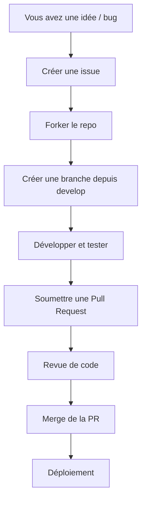

# Guide de contribution à sygdn-api

Merci de votre intérêt pour contribuer à ce projet ! Ce document explique comment participer efficacement au développement de sygdn-api.

## Table des matières

- [Code de conduite](#code-de-conduite)
- [Stack technique](#stack-technique)
- [Aperçu du processus de contribution](#aperçu-du-processus-de-contribution)
- [Proposer un changement](#proposer-un-changement)
- [Créer une pull request](#créer-une-pull-request)
- [Style de code & conventions](#style-de-code--conventions)
- [Exemples de bonnes pratiques](#exemples-de-bonnes-pratiques)
- [Tests](#tests)
- [Processus de revue de code](#processus-de-revue-de-code)
- [Checklist pour les Pull Requests](#checklist-pour-les-pull-requests)
- [Gestion des issues](#gestion-des-issues)
- [Questions](#questions)

---

## Code de conduite

En participant à ce projet, vous acceptez de respecter le [Code de conduite](CODE_OF_CONDUCT.md) du projet.

## Stack technique

Le projet sygdn-api est principalement développé avec :

- **TypeScript** (langage principal)
- **Node.js** (runtime)
- **NestJS** (framework backend)
- **GraphQL** (API)
- **PostgreSQL** (base de données)
- **Docker** (déploiement et environnement)
- **Linter** (qualité de code)
- Pratiques de **sécurité** intégrées

## Aperçu du processus de contribution



## Proposer un changement

1. **Forkez** ce dépôt et clonez-le en local.
2. Créez une branche à partir de `develop` :
   ```bash
   git checkout -b feat/mon-nouvel-ajout
   ```
3. Effectuez vos modifications. Rédigez des messages de commit clairs et explicites.
4. Vérifiez que le code fonctionne et que tous les tests passent.

## Créer une pull request

- Poussez votre branche sur votre fork.
- Depuis GitHub, ouvrez une *Pull Request* (PR) vers la branche `develop` du dépôt principal.
- Décrivez clairement votre changement dans la PR :
  - Quel problème cela résout-il ?
  - Quels changements avez-vous apportés ?
  - Comment tester votre contribution ?

## Style de code & conventions

- Respectez le style du projet (indentation, nommage…).
- Utilisez Prettier et ESLint pour valider la qualité du code :
  ```bash
  npm run lint
  npm run format
  ```
- Structurez votre code de manière modulaire.
- Ajoutez des commentaires si nécessaire.
- Les contributions doivent être en TypeScript.

## Exemples de bonnes pratiques

- **Commit message** :
  - `fix(user): corrige l'affichage du profil`
  - `feat(auth): ajoute la connexion via Google`
- **Nom de branche** :
  - `feat/ajout-auth-google`
  - `fix/bug-affichage-dashboard`
- **Description de PR claire** :
  - Résumez le changement apporté.
  - Expliquez le contexte si besoin.
- **Tests** :
  - Toujours couvrir la nouvelle logique métier par des tests.

## Tests

- Ajoutez ou mettez à jour les tests unitaires pour chaque fonctionnalité ou correction apportée.
- Vérifiez que la suite de tests passe avant de soumettre une PR :
  ```bash
  npm run test
  ```
- Des tests d’intégration via GraphQL sont appréciés.

## Processus de revue de code

- Un ou plusieurs mainteneurs examineront votre PR.
- Critères principaux :
  - Respect des conventions et de la qualité de code
  - Couverture de tests suffisante
  - Pertinence et clarté des changements
- Des suggestions ou demandes de modifications peuvent être formulées : répondez-y ou ajustez votre PR.
- Une fois validée, la PR sera fusionnée ou planifiée pour un déploiement.

## Checklist pour les Pull Requests

Avant de soumettre votre PR, merci de vérifier :

- [ ] Les tests passent localement
- [ ] Le code suit les conventions du projet
- [ ] Les dépendances inutiles ont été supprimées
- [ ] La documentation et/ou les exemples ont été mis à jour si besoin
- [ ] La PR est reliée à une issue (si applicable)
- [ ] Les reviewers sont assignés (si nécessaire)

## Gestion des issues

- Avant d’ouvrir une nouvelle issue, vérifiez qu’elle n’a pas déjà été soulevée ou traitée.
- Soyez précis dans votre description (étapes pour reproduire, logs, environnement…).
- N’hésitez pas à proposer des améliorations ou signaler des bugs.

## Questions

Pour toute question, ouvrez une issue ou contactez un mainteneur du projet.

Merci pour votre contribution !
